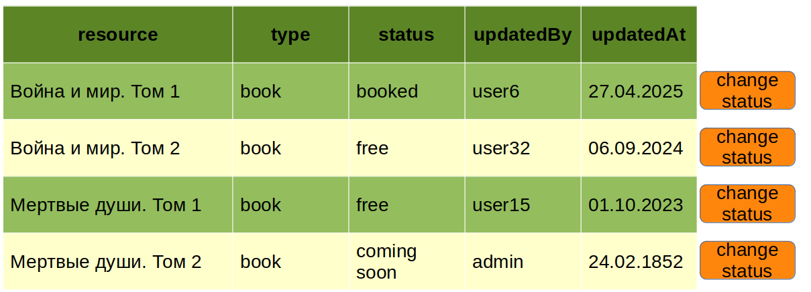

# Statuses of Resources

**Statuses of Resources** — это микросервис для работы со статусами объектов.  
Он упрощает управление жизненным циклом сущностей в приложениях, где требуется отслеживание, изменение и контроль состояний.

## Краткое описание

Микросервис позволяет:
- Хранить статусы объектов.
- Управлять словарями статусов.
- Связывать словари статусов с типами объектов.

Проект создан для стандартизации работы со статусами и минимизации дублирования кода при реализации логики смены состояний в бизнес-приложениях.

---

## Документация

1. [Целевая аудитория](./docs/01-target-audience.md)
2. [MVP](./docs/02-mvp.md)
3. [API и модели](./docs/03-models.md)
4. [Архитектура](./docs/architecture/arch.md)
5. [Файлы сборки](./deploy)

---
