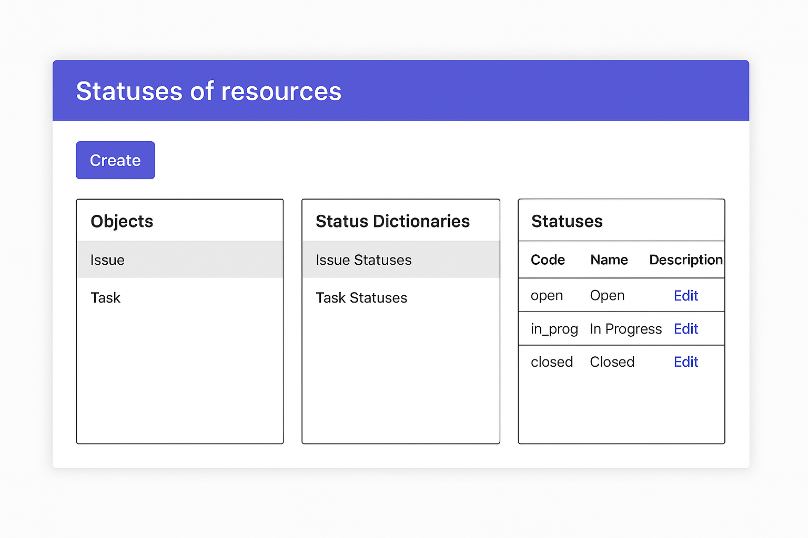

## MVP проекта

**Что входит в первую версию:**

CRUD для объектов Resource c сохранением любых типов объектов и статусов в виде строки

**Дальнейшее развитие:**

- CRUD API для управления:
    - Типами объектов
    - Словарями статусов
    - Связями словарей и типов объектов

